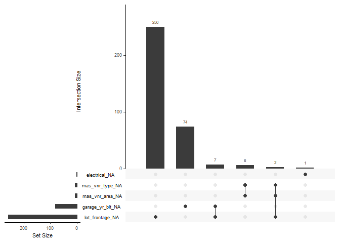

Untitled
================

## Missing data

I start by fixing the obvious missing values. The only problematic
variable seems to be year built for garage where the garace is missing.
One way would be to replace NA with year built for the house itselfe.

``` r
# Missing data according to data_description.txt file

training$PoolQC[is.na(training$PoolQC)] <- "no_pool"
training$MiscFeature[is.na(training$MiscFeature)] <- "none"
training$Alley[is.na(training$Alley)] <- "no_alley"
training$Fence[is.na(training$Fence)] <- "no_fence"
training$FireplaceQu[is.na(training$FireplaceQu)] <- "no_fireplace"

#  Basement
training$BsmtFinType2[is.na(training$BsmtFinType2)] <- "no_basement"
training$BsmtFinType1[is.na(training$BsmtFinType1)] <- "no_basement"
training$BsmtExposure[is.na(training$BsmtExposure)] <- "no_basement"
training$BsmtQual[is.na(training$BsmtQual)] <- "no_basement"
training$BsmtCond[is.na(training$BsmtCond)] <- "no_basement"

# Garage
training$GarageType[is.na(training$GarageType)] <- "no_garage"
training$GarageFinish[is.na(training$GarageFinish)] <- "no_garage"
training$GarageQual[is.na(training$GarageQual)] <- "no_garage"
training$GarageCond[is.na(training$GarageCond)] <- "no_garage"


df_missing <- map_df(training, function(x) mean(is.na(x))) %>%
        gather()

ggplot(filter(df_missing, value > 0),
       aes(x = fct_reorder(key, value),
           y = value)) +
        geom_bar(stat = "identity") +
        coord_flip()
```

<!-- -->

### Further investigation into missing values

``` r
convert_missing <- function(x) ifelse(is.na(x), 0, 1)

house_missing <- apply(training, 2, convert_missing)

Heatmap(house_missing,
        name = "Missing",
        column_title = "Predictors",
        row_title = "Samles",
        col = c("black", "lightgrey"),
        show_heatmap_legend = FALSE,
        row_names_gp = gpar(fontsize = 0)) # text size for row names
```

<!-- -->

``` r
gg_miss_upset(training)
```

<!-- -->

### LotFrontage

LotFrontage referce to *Linear feet of street connected to property*.
When compared to SalePrice there doesn’t seems to be that much of a
difference in sale price whether or not the LotFrontage is missing. It
could be that the actual value is 0 but we dont’ know for sure. So we
can impute the missing values using KNN or Bagging and compare it to
imputing the missing values with zero.

#### Numeric variables and missingness of LotFrontage

No clear pattern.

``` r
df_numeric <- training %>% 
        select_if(is.numeric) %>% 
        mutate(LotFrontage_cat = ifelse(is.na(LotFrontage), "missing", "no_missing")) %>% 
        select(-Id,- LotFrontage) %>% 
        select(LotFrontage_cat, everything()) %>% 
        gather("key", "value", 2:37)

ggplot(df_numeric,
       aes(x = LotFrontage_cat,
           y = value,
           col = LotFrontage_cat)) + 
        geom_violin() +
        facet_wrap(~key, ncol = 6, scales = "free_y")
```

    ## Warning: Removed 89 rows containing non-finite values (stat_ydensity).

<!-- -->

#### Categorical variables and connection to LotFrontage

``` r
df_categorical <- training %>% 
        select_if(is.character)

df_lot <- training %>% 
        select(Id, LotFrontage)

df_categorical <- bind_cols(df_lot, df_categorical) %>% select(-Id)

df_categorical <- df_categorical %>% 
        gather("key", "value", 2:44) %>% 
        group_by(key, value) %>% 
        summarise(missing = mean(is.na(LotFrontage)),
                  fjoldi = n()) %>% 
        arrange(desc(missing))

head(df_categorical, 10)
```

    ## # A tibble: 10 x 4
    ## # Groups:   key [8]
    ##    key         value   missing fjoldi
    ##    <chr>       <chr>     <dbl>  <int>
    ##  1 Condition2  RRAe      1          1
    ##  2 Condition2  RRAn      1          1
    ##  3 Functional  Sev       1          1
    ##  4 Heating     Floor     1          1
    ##  5 MiscFeature Gar2      1          2
    ##  6 RoofMatl    Metal     1          1
    ##  7 RoofStyle   Shed      1          2
    ##  8 Utilities   NoSeWa    1          1
    ##  9 LandSlope   Sev       0.615     13
    ## 10 RoofMatl    WdShake   0.6        5

``` r
# ggplot(df_categorical,
#        aes(x = value,
#            y = missing,
#            fill = value)) +
#         geom_bar(stat = "identity") +
#         facet_wrap(~key) + 
#         theme(legend.position = "none")
```

### GarageYrBlt

Problematic variable. It is numeric but contains NA’s for properties
with no garage. Could impute with the year the house was built. First
I’ll check if this variable is important or not using random
forest.

``` r
# I have to change all character variables to factor. Got an error: Error in gower_work....

train_no_garageyrblt <- training[!is.na(training$GarageYrBlt), ] %>% select(-Id) %>% 
        mutate_if(is.character, as.factor) %>% 
        janitor::clean_names()

ames_rf_importance <- recipe(sale_price ~ ., data = train_no_garageyrblt) %>% 
        step_knnimpute(all_predictors(), neighbors = 5) %>% 
        prep(train_no_garageyrblt) %>% 
        bake(train_no_garageyrblt)

n_features <- length(setdiff(names(train_no_garageyrblt), "sale_price"))


rf_model_importance <- ranger::ranger(sale_price ~ .,
                                      data = ames_rf_importance,
                                      mtry = floor(n_features / 3),
                                      respect.unordered.factors = "order",
                                      importance = "impurity")
```

#### Is GarageYrBlt important?

``` r
df_rf_importance <- as.data.frame(rf_model_importance$variable.importance) %>% 
        rownames_to_column(var = "variable") %>% 
        as_tibble()

colnames(df_rf_importance) <- c("variable", "importance")
df_rf_importance <- df_rf_importance %>% arrange(desc(importance))

ggplot(df_rf_importance,
       aes(x = fct_reorder(variable, -importance),
           y = importance)) +
        geom_bar(stat = "identity") + 
        coord_flip()
```

<!-- -->

``` r
rank_garagyrb <- which(df_rf_importance$variable == "garage_yr_blt")
yrblt_garageyrb <- mean(train_no_garageyrblt$year_built == train_no_garageyrblt$garage_yr_blt)
```

The year when the garage is built ranks number 20 of 79 variables in the
dataset. I could replace the garage\_yr\_blt with year\_built. 0.7897027
of garages were built the same year as the house. So I’m not 100% sure
if I should impute garage\_yr\_built with year\_built.

``` r
ggplot(train_no_garageyrblt,
       aes(x = year_built,
           y = garage_yr_blt)) + 
        geom_point()
```

<!-- -->

### Recipe

``` r
# ames_recipe_knn <- recipe(SalePrice ~ ., data = training) %>% 
#         step_log(all_outcomes()) %>% 
#         step_knnimpute()
```
