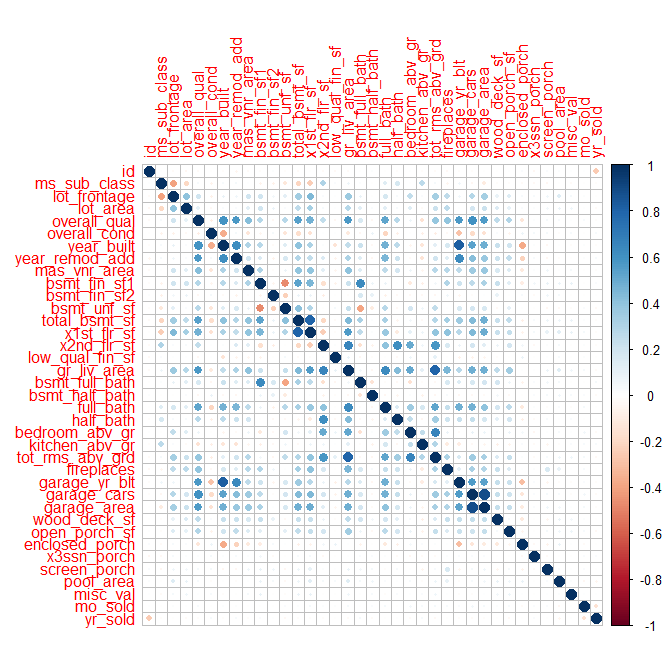
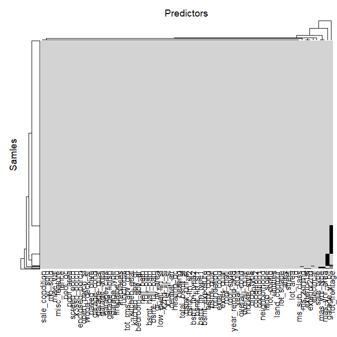
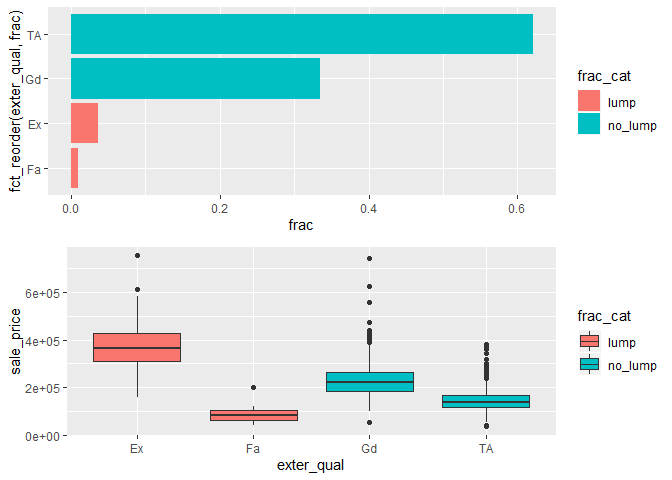
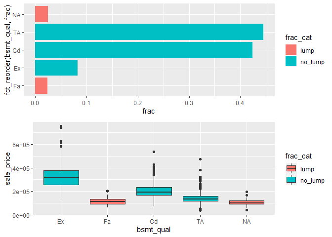
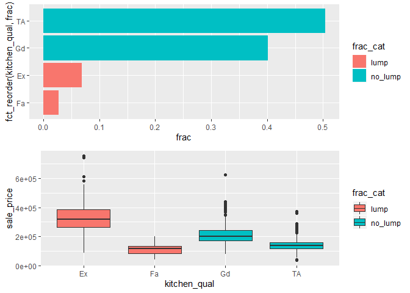

House Prices: Advanced Regression Techniques
================

## Missing data

I start by fixing the obvious missing values. The only problematic
variable seems to be year built for garage where the garace is missing.
One way would be to replace NA with year built for the house itselfe.

``` r
# Missing data according to data_description.txt file

training$pool_qc[is.na(training$pool_qc)] <- "no_pool"
training$misc_feature[is.na(training$misc_feature)] <- "none"
training$alley[is.na(training$alley)] <- "no_alley"
training$fence[is.na(training$fence)] <- "no_fence"
training$fireplace_qu[is.na(training$fireplace_qu)] <- "no_fireplace"

#  Basement
training$bsmt_fin_type2[is.na(training$bsmt_fin_type2)] <- "no_basement"
training$bsmt_fin_type1[is.na(training$bsmt_fin_type1)] <- "no_basement"
training$bsmt_exposure[is.na(training$bsmt_exposure)] <- "no_basement"
training$bsmt_qual[is.na(training$bsmt_qual)] <- "no_basement"
training$bsmt_cond[is.na(training$bsmt_cond)] <- "no_basement"

# Garage
training$garage_type[is.na(training$garage_type)] <- "no_garage"
training$garage_finish[is.na(training$garage_finish)] <- "no_garage"
training$garage_qual[is.na(training$garage_qual)] <- "no_garage"
training$garage_cond[is.na(training$garage_cond)] <- "no_garage"


df_missing <- map_df(training, function(x) mean(is.na(x))) %>%
        gather()

ggplot(filter(df_missing, value > 0),
       aes(x = fct_reorder(key, value),
           y = value)) +
        geom_bar(stat = "identity") +
        coord_flip()
```

<!-- -->

### Further investigation into missing values

``` r
convert_missing <- function(x) ifelse(is.na(x), 0, 1)

house_missing <- apply(training, 2, convert_missing)

Heatmap(house_missing,
        name = "Missing",
        column_title = "Predictors",
        row_title = "Samles",
        col = c("black", "lightgrey"),
        show_heatmap_legend = FALSE,
        row_names_gp = gpar(fontsize = 0)) # text size for row names
```

<!-- -->

``` r
gg_miss_upset(training)
```

<!-- -->

### LotFrontage

LotFrontage referce to *Linear feet of street connected to property*.
When compared to SalePrice there doesn’t seems to be that much of a
difference in sale price whether or not the LotFrontage is missing. It
could be that the actual value is 0 but we dont’ know for sure. So we
can impute the missing values using KNN or Bagging and compare it to
imputing the missing values with zero.

#### Numeric variables and missingness of LotFrontage

No clear pattern.

``` r
df_numeric <- training %>% 
        select_if(is.numeric) %>% 
        mutate(LotFrontage_cat = ifelse(is.na(lot_frontage), "missing", "no_missing")) %>% 
        select(-id,- lot_frontage) %>% 
        select(LotFrontage_cat, everything()) %>% 
        gather("key", "value", 2:37)

ggplot(df_numeric,
       aes(x = LotFrontage_cat,
           y = value,
           col = LotFrontage_cat)) + 
        geom_violin() +
        facet_wrap(~key, ncol = 6, scales = "free_y") + 
        theme(legend.position = "bottom")
```

<!-- -->

#### Categorical variables and connection to LotFrontage

``` r
df_categorical <- training %>% 
        select_if(is.character)

df_lot <- training %>% 
        select(id, lot_frontage)

df_categorical_lot <- bind_cols(df_lot, df_categorical) %>% select(-id)

df_categorical <- df_categorical_lot %>% 
        gather("key", "value", 2:44) %>% 
        group_by(key, value) %>% 
        summarise(missing = mean(is.na(lot_frontage)),
                  fjoldi = n()) %>% 
        arrange(desc(missing))

head(df_categorical, 10)
```

    ## # A tibble: 10 x 4
    ## # Groups:   key [8]
    ##    key          value   missing fjoldi
    ##    <chr>        <chr>     <dbl>  <int>
    ##  1 condition2   RRAe      1          1
    ##  2 condition2   RRAn      1          1
    ##  3 functional   Sev       1          1
    ##  4 heating      Floor     1          1
    ##  5 misc_feature Gar2      1          2
    ##  6 roof_matl    Metal     1          1
    ##  7 roof_style   Shed      1          2
    ##  8 utilities    NoSeWa    1          1
    ##  9 land_slope   Sev       0.615     13
    ## 10 roof_matl    WdShake   0.6        5

### GarageYrBlt

Problematic variable. It is numeric but contains NA’s for properties
with no garage. Could impute with the year the house was built. First
I’ll check if this variable is important or not using random
forest.

``` r
# I have to change all character variables to factor. Got an error: Error in gower_work....

train_no_garageyrblt <- training[!is.na(training$garage_yr_blt), ] %>% select(-id) %>% 
        mutate_if(is.character, as.factor)

ames_rf_importance <- recipe(sale_price ~ ., data = train_no_garageyrblt) %>% 
        step_knnimpute(all_predictors(), neighbors = 5) %>% 
        prep(train_no_garageyrblt) %>% 
        bake(train_no_garageyrblt)

n_features <- length(setdiff(names(train_no_garageyrblt), "sale_price"))


rf_model_importance <- ranger::ranger(sale_price ~ .,
                                      data = ames_rf_importance,
                                      mtry = floor(n_features / 3),
                                      respect.unordered.factors = "order",
                                      importance = "impurity")
```

#### Is GarageYrBlt important?

``` r
df_rf_importance <- as.data.frame(rf_model_importance$variable.importance) %>% 
        rownames_to_column(var = "variable") %>% 
        as_tibble()

colnames(df_rf_importance) <- c("variable", "importance")
df_rf_importance <- df_rf_importance %>% arrange(desc(importance))

# Finn út hvort breytan sé numeric eða ekki

df_tegund <- map_df(training, function(x) is.numeric(x)) %>% 
        gather("variable", "is_numeric")

df_rf_importance <- left_join(df_rf_importance, df_tegund)

ggplot(df_rf_importance,
       aes(x = fct_reorder(variable, -importance),
           y = importance,
           fill = is_numeric)) +
        geom_bar(stat = "identity") + 
        coord_flip()
```

<!-- -->

``` r
rank_garagyrb <- which(df_rf_importance$variable == "garage_yr_blt")
yrblt_garageyrb <- mean(train_no_garageyrblt$year_built == train_no_garageyrblt$garage_yr_blt)
```

The year when the garage is built ranks number 22 of 79 variables in the
dataset. I could replace the garage\_yr\_blt with year\_built. 0.7897027
of garages were built the same year as the house. So I’m not 100% sure
if I should impute garage\_yr\_built with year\_built.

``` r
ggplot(train_no_garageyrblt,
       aes(x = year_built,
           y = garage_yr_blt)) + 
        geom_point()
```

<!-- -->

### Imputing vs. recoding

Let’s now compare the cross validated accuracy between models when
imputing the garage\_yr\_blt with the year\_built variable and when the
variable is recoded as 1 for garage, and 0 for no garage.

``` r
train_gar_imp <- training %>% 
        mutate(garage_yr_blt = case_when(is.na(garage_yr_blt) ~ year_built,
                                         TRUE ~ garage_yr_blt)) %>% 
        mutate_if(is.character, as.factor)

# Impute
train_gar_imp_train <- train_gar_imp[1:1000, ]
train_gar_imp_test <- train_gar_imp[1001:1460, ]

ames_rf_impute <- recipe(sale_price ~ ., data = train_gar_imp_train) %>% 
        step_knnimpute(all_predictors(), neighbors = 5) %>% 
        prep(train_gar_imp)

ames_rf_imp_train <- bake(ames_rf_impute, new_data = train_gar_imp_train)
ames_rf_imp_test <- bake(ames_rf_impute, new_data = train_gar_imp_test)


# Recode
train_gar_recode <- training %>% 
        mutate(garage_yr_blt_recode = case_when(is.na(garage_yr_blt) ~ 0,
                                                TRUE ~ 1)) %>%
        select(-garage_yr_blt) %>% 
        mutate_if(is.character, as.factor)

train_gar_recode_train <- train_gar_recode[1:1000, ]
train_gar_recode_test <- train_gar_recode[1001:1460, ]


ames_rf_recode <- recipe(sale_price ~ ., data = train_gar_recode_train) %>% 
        step_knnimpute(all_predictors(), neighbors = 5) %>% 
        prep(train_gar_recode)

ames_rf_recode_train <- bake(ames_rf_recode, new_data = train_gar_recode_train)
ames_rf_recode_test <- bake(ames_rf_recode, new_data = train_gar_recode_test)


# Modelling
n_features_imp <- length(setdiff(names(train_gar_imp_train), "sale_price"))
n_features_rec <- length(setdiff(names(train_gar_recode_train), "sale_price"))


rf_model_imp <- ranger::ranger(sale_price ~ .,
                               data = ames_rf_imp_train,
                               mtry = floor(n_features_imp / 3),
                               respect.unordered.factors = "order",
                               importance = "impurity")

rf_model_rec <- ranger::ranger(sale_price ~ .,
                               data = ames_rf_recode_train,
                               mtry = floor(n_features_rec / 3),
                               respect.unordered.factors = "order",
                               importance = "impurity")


pred_imp <- predict(rf_model_imp, data = ames_rf_imp_test)$predictions
pred_rec <- predict(rf_model_rec, data = ames_rf_recode_test)$predictions


RMSE(pred_imp, train_gar_imp_test$sale_price)
```

    ## [1] 28852.33

``` r
RMSE(pred_rec, train_gar_recode_test$sale_price)
```

    ## [1] 29275.29

There is almost no differene in RMSE when recoding the variable vs. when
the variable is imputed with year\_built. Even though there is a tiny
difference, I’m going to make two data sets. The tiny difference only
applies to random forest. Maybe neural network or elastic net will be
able to use imputed data better than recoded.

### New data

``` r
# Imputed
training_imputed <- training %>% 
        mutate(garage_yr_blt = case_when(is.na(garage_yr_blt) ~ year_built,
                                         TRUE ~ garage_yr_blt)) %>% 
        mutate_if(is.character, as.factor)

# Recoded
training_recode <- training %>% 
        mutate(garage_yr_blt_recode = case_when(is.na(garage_yr_blt) ~ 0,
                                                TRUE ~ 1)) %>%
        select(-garage_yr_blt) %>% 
        mutate_if(is.character, as.factor)
```

### Analysis of categorical variables

I can either lump rare categories and then create dummy variable or, if
the variable is not important according to random forest, I can just
recode the variable.

``` r
df_categorical <- training %>% 
        select_if(is.character)

# number of categories in each variable

df_categorical %>% 
        gather() %>% 
        group_by(key) %>% 
        summarise(number = n_distinct(value)) %>% 
        ggplot(aes(x = fct_reorder(key, number),
                   y =  number)) +
        geom_bar(stat = "identity") +
        coord_flip()
```

<!-- -->

#### Neighborhood

``` r
# neighborhood - fraction
df_categorical %>% 
        group_by(neighborhood) %>% 
        summarise(frac = n()/1460) %>%
        mutate(frac_cat = case_when(frac <= 0.02 ~ "lumb",
                                    TRUE ~ "no_lumb")) %>% 
        ggplot(aes(x = fct_reorder(neighborhood, frac),
                   y = frac,
                   fill = frac_cat)) + 
        geom_bar(stat = "identity") +
        coord_flip()
```

<!-- -->

#### exterior2nd

``` r
df_categorical %>% 
        group_by(exterior2nd) %>% 
        summarise(frac = n()/1460) %>%
        mutate(frac_cat = case_when(frac <= 0.05 ~ "lumb",
                                    TRUE ~ "no_lumb")) %>% 
        ggplot(aes(x = fct_reorder(exterior2nd, frac),
                   y = frac,
                   fill = frac_cat)) + 
        geom_bar(stat = "identity") +
        coord_flip()
```

<!-- -->

### Variables to lump

  - Neighborhood using threashold of 0.02.

### Visualisation of numeric variables

``` r
df_numeric <- training %>% select_if(is.numeric)
```

### Recipe

``` r
# ames_recipe_knn <- recipe(SalePrice ~ ., data = training) %>% 
#         step_log(all_outcomes()) %>% 
#         step_knnimpute()
```
