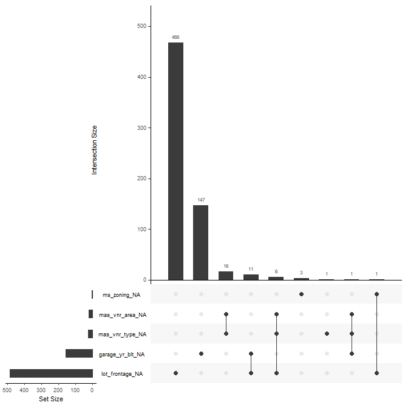

House Prices: Advanced Regression Techniques
================

  - [Introduction](#introduction)
      - [First step](#first-step)
  - [EDA](#eda)
      - [Correlation among predictos](#correlation-among-predictos)
      - [Analyzing missing values](#analyzing-missing-values)
          - [lot\_frontage](#lot_frontage)
          - [garage\_yr\_blt](#garage_yr_blt)
      - [Omitting vs. recoding](#omitting-vs.-recoding)
  - [Analysis of categorical
    variables](#analysis-of-categorical-variables)
      - [Important categorical variables and number of
        categories](#important-categorical-variables-and-number-of-categories)
      - [Neighborhood](#neighborhood)
      - [exter\_qual - ordered variable](#exter_qual---ordered-variable)
      - [bsmt\_qual](#bsmt_qual)
      - [kitchen\_qual](#kitchen_qual)
          - [Lumping variables](#lumping-variables)
  - [Analyzis of numeric variables](#analyzis-of-numeric-variables)
      - [Transforming numeric
        variables](#transforming-numeric-variables)
      - [Variables with lots of zeros](#variables-with-lots-of-zeros)
  - [Feature engineering](#feature-engineering)
      - [Interaction effects](#interaction-effects)
      - [New variable using unsupervised
        learning](#new-variable-using-unsupervised-learning)
          - [K-means](#k-means)
          - [Hierarchial clustering](#hierarchial-clustering)
          - [Gaussian mixture models](#gaussian-mixture-models)
          - [Importance of clusters](#importance-of-clusters)
      - [Save the final data](#save-the-final-data)

# Introduction

In this blog I will walk through the steps I take in analyzing and
modelling the data for this competition. This is the first Kaggle
competition I participate in. You can read about it
[here](https://www.kaggle.com/c/house-prices-advanced-regression-techniques/overview).

## First step

First I combine the training and the test set. I only do this because I
have fix few variable that have missing values but with know reason, see
the data description text file. After fixing the missing values I split
the dataset back to training and test using the id’s from both dataset.
Since the reason of missingness is known and it’s the same between
training and test set there is no danger of lookahead bias.

``` r
# Missing data according to data_description.txt file

# Various
all$pool_qc[is.na(all$pool_qc)] <- "no_pool"
all$misc_feature[is.na(all$misc_feature)] <- "none"
all$alley[is.na(all$alley)] <- "no_alley"
all$fence[is.na(all$fence)] <- "no_fence"
all$fireplace_qu[is.na(all$fireplace_qu)] <- "no_fireplace"

#  Basement
all$bsmt_fin_type2[is.na(all$bsmt_fin_type2)] <- "no_basement"
all$bsmt_fin_type1[is.na(all$bsmt_fin_type1)] <- "no_basement"
all$bsmt_exposure[is.na(all$bsmt_exposure)] <- "no_basement"
all$bsmt_qual[is.na(all$bsmt_qual)] <- "no_basement"
all$bsmt_cond[is.na(all$bsmt_cond)] <- "no_basement"

# Garage
all$garage_type[is.na(all$garage_type)] <- "no_garage"
all$garage_finish[is.na(all$garage_finish)] <- "no_garage"
all$garage_qual[is.na(all$garage_qual)] <- "no_garage"
all$garage_cond[is.na(all$garage_cond)] <- "no_garage"


df_missing <- map_df(all, function(x) mean(is.na(x))) %>%
        gather()

ggplot(filter(df_missing, value > 0),
       aes(x = fct_reorder(key, value),
           y = value)) +
        geom_bar(stat = "identity") +
        coord_flip()
```

<!-- -->

# EDA

I’ll start by exploring the data visually. The first thing I do is to
look at the distribution of numeric variables. As can be seen in the
plot several of the numerical variables are categorical. For those
variables I’ll probably create full set of dummy variables and remove
the zero-variance predictos. According to Kuhn and Johnson this is
simple and effective way.

``` r
all %>% 
        select_if(is.numeric) %>% 
        pivot_longer(cols = 2:36,
                     names_to = "breytur",
                     values_to = "gildi") %>% 
        ggplot(aes(x = gildi)) +
        geom_histogram() +
        facet_wrap(~ breytur, ncol = 6, scales = "free")
```

<!-- -->

``` r
training %>% 
        select_if(is.numeric) %>% 
        pivot_longer(cols = 2:37,
                     names_to = "key",
                     values_to = "value") %>% 
        ggplot(aes(x = value, y = log(sale_price))) +
        facet_wrap(~ key, scales = "free") + 
        geom_point()
```

<!-- -->

Since I’m planning to use Elastic Net I might need to transform some of
the variables using either Box-Cox or Yeo johnson. Tree-based algorithms
can handle skewed distribution. Elastic Net (a linear model with
regularization) performance could be improved by transforming relevant
variables.

## Correlation among predictos

Before plotting the correlation matrix I have to impute the missing
values. I’ll use the mice package which uses random forest to imputed
the missing values.  
According to the correlation plot there are few variables with high
correlation. The year the house was built and the garage has high
correlation. As will be discussed below the variable garage\_yr\_blt
will be removed from the dataset.

``` r
all_numeric <- all %>%  select_if(is.numeric) 
mice_mod <- mice(all_numeric, method = "rf")
```

    ## 
    ##  iter imp variable
    ##   1   1  lot_frontage  mas_vnr_area  bsmt_fin_sf1  bsmt_fin_sf2  bsmt_unf_sf  total_bsmt_sf  bsmt_full_bath  bsmt_half_bath  garage_yr_blt  garage_cars  garage_area
    ##   1   2  lot_frontage  mas_vnr_area  bsmt_fin_sf1  bsmt_fin_sf2  bsmt_unf_sf  total_bsmt_sf  bsmt_full_bath  bsmt_half_bath  garage_yr_blt  garage_cars  garage_area
    ##   1   3  lot_frontage  mas_vnr_area  bsmt_fin_sf1  bsmt_fin_sf2  bsmt_unf_sf  total_bsmt_sf  bsmt_full_bath  bsmt_half_bath  garage_yr_blt  garage_cars  garage_area
    ##   1   4  lot_frontage  mas_vnr_area  bsmt_fin_sf1  bsmt_fin_sf2  bsmt_unf_sf  total_bsmt_sf  bsmt_full_bath  bsmt_half_bath  garage_yr_blt  garage_cars  garage_area
    ##   1   5  lot_frontage  mas_vnr_area  bsmt_fin_sf1  bsmt_fin_sf2  bsmt_unf_sf  total_bsmt_sf  bsmt_full_bath  bsmt_half_bath  garage_yr_blt  garage_cars  garage_area
    ##   2   1  lot_frontage  mas_vnr_area  bsmt_fin_sf1  bsmt_fin_sf2  bsmt_unf_sf  total_bsmt_sf  bsmt_full_bath  bsmt_half_bath  garage_yr_blt  garage_cars  garage_area
    ##   2   2  lot_frontage  mas_vnr_area  bsmt_fin_sf1  bsmt_fin_sf2  bsmt_unf_sf  total_bsmt_sf  bsmt_full_bath  bsmt_half_bath  garage_yr_blt  garage_cars  garage_area
    ##   2   3  lot_frontage  mas_vnr_area  bsmt_fin_sf1  bsmt_fin_sf2  bsmt_unf_sf  total_bsmt_sf  bsmt_full_bath  bsmt_half_bath  garage_yr_blt  garage_cars  garage_area
    ##   2   4  lot_frontage  mas_vnr_area  bsmt_fin_sf1  bsmt_fin_sf2  bsmt_unf_sf  total_bsmt_sf  bsmt_full_bath  bsmt_half_bath  garage_yr_blt  garage_cars  garage_area
    ##   2   5  lot_frontage  mas_vnr_area  bsmt_fin_sf1  bsmt_fin_sf2  bsmt_unf_sf  total_bsmt_sf  bsmt_full_bath  bsmt_half_bath  garage_yr_blt  garage_cars  garage_area
    ##   3   1  lot_frontage  mas_vnr_area  bsmt_fin_sf1  bsmt_fin_sf2  bsmt_unf_sf  total_bsmt_sf  bsmt_full_bath  bsmt_half_bath  garage_yr_blt  garage_cars  garage_area
    ##   3   2  lot_frontage  mas_vnr_area  bsmt_fin_sf1  bsmt_fin_sf2  bsmt_unf_sf  total_bsmt_sf  bsmt_full_bath  bsmt_half_bath  garage_yr_blt  garage_cars  garage_area
    ##   3   3  lot_frontage  mas_vnr_area  bsmt_fin_sf1  bsmt_fin_sf2  bsmt_unf_sf  total_bsmt_sf  bsmt_full_bath  bsmt_half_bath  garage_yr_blt  garage_cars  garage_area
    ##   3   4  lot_frontage  mas_vnr_area  bsmt_fin_sf1  bsmt_fin_sf2  bsmt_unf_sf  total_bsmt_sf  bsmt_full_bath  bsmt_half_bath  garage_yr_blt  garage_cars  garage_area
    ##   3   5  lot_frontage  mas_vnr_area  bsmt_fin_sf1  bsmt_fin_sf2  bsmt_unf_sf  total_bsmt_sf  bsmt_full_bath  bsmt_half_bath  garage_yr_blt  garage_cars  garage_area
    ##   4   1  lot_frontage  mas_vnr_area  bsmt_fin_sf1  bsmt_fin_sf2  bsmt_unf_sf  total_bsmt_sf  bsmt_full_bath  bsmt_half_bath  garage_yr_blt  garage_cars  garage_area
    ##   4   2  lot_frontage  mas_vnr_area  bsmt_fin_sf1  bsmt_fin_sf2  bsmt_unf_sf  total_bsmt_sf  bsmt_full_bath  bsmt_half_bath  garage_yr_blt  garage_cars  garage_area
    ##   4   3  lot_frontage  mas_vnr_area  bsmt_fin_sf1  bsmt_fin_sf2  bsmt_unf_sf  total_bsmt_sf  bsmt_full_bath  bsmt_half_bath  garage_yr_blt  garage_cars  garage_area
    ##   4   4  lot_frontage  mas_vnr_area  bsmt_fin_sf1  bsmt_fin_sf2  bsmt_unf_sf  total_bsmt_sf  bsmt_full_bath  bsmt_half_bath  garage_yr_blt  garage_cars  garage_area
    ##   4   5  lot_frontage  mas_vnr_area  bsmt_fin_sf1  bsmt_fin_sf2  bsmt_unf_sf  total_bsmt_sf  bsmt_full_bath  bsmt_half_bath  garage_yr_blt  garage_cars  garage_area
    ##   5   1  lot_frontage  mas_vnr_area  bsmt_fin_sf1  bsmt_fin_sf2  bsmt_unf_sf  total_bsmt_sf  bsmt_full_bath  bsmt_half_bath  garage_yr_blt  garage_cars  garage_area
    ##   5   2  lot_frontage  mas_vnr_area  bsmt_fin_sf1  bsmt_fin_sf2  bsmt_unf_sf  total_bsmt_sf  bsmt_full_bath  bsmt_half_bath  garage_yr_blt  garage_cars  garage_area
    ##   5   3  lot_frontage  mas_vnr_area  bsmt_fin_sf1  bsmt_fin_sf2  bsmt_unf_sf  total_bsmt_sf  bsmt_full_bath  bsmt_half_bath  garage_yr_blt  garage_cars  garage_area
    ##   5   4  lot_frontage  mas_vnr_area  bsmt_fin_sf1  bsmt_fin_sf2  bsmt_unf_sf  total_bsmt_sf  bsmt_full_bath  bsmt_half_bath  garage_yr_blt  garage_cars  garage_area
    ##   5   5  lot_frontage  mas_vnr_area  bsmt_fin_sf1  bsmt_fin_sf2  bsmt_unf_sf  total_bsmt_sf  bsmt_full_bath  bsmt_half_bath  garage_yr_blt  garage_cars  garage_area

``` r
mice_output <- complete(mice_mod)

M <- cor(mice_output)
corrplot(M, method = "circle")
```

<!-- -->

## Analyzing missing values

In analyzing missing data I used methods outlined in **Feature
Engineering and Selection** by Max Kuhn and Kjell Johnson. You can read
the book online here: <http://www.feat.engineering/> The heatmap below
shows that most predictors and samples have nearly complete information.

``` r
convert_missing <- function(x) ifelse(is.na(x), 0, 1)

house_missing <- apply(all, 2, convert_missing)

Heatmap(house_missing[sample(nrow(house_missing), 1000), ],
        name = "Missing",
        column_title = "Predictors",
        row_title = "Samles",
        col = c("black", "lightgrey"),
        show_heatmap_legend = FALSE,
        row_names_gp = gpar(fontsize = 0)) # text size for row names
```

<!-- -->

Using co-occurance plot can further deepen our understanding on missing
information. With this plot we can see if any variables tend to be
missing together. For this dataset that doesn’t seem to be the case
except maybe for mas\_vnr\_area and mas\_vnr\_type. Those are only 16
samples out of 2.919. Those will be imputed later using K-nearest
neighbors (KNN). Note that I could also use bagged trees to impute
missing values. However I will go with KNN here.

``` r
gg_miss_upset(all)
```

<!-- -->

### lot\_frontage

lot\_frontage referce to *Linear feet of street connected to property*.
When compared to sale\_price there doesn’t seems to be that much of a
difference whether or not the lot\_frontage is missing. There are three
ways we can deal with this variable:

1)  Delete the variable
2)  Impute NA’s with zero
3)  Impute NA´s using KNN (Bagging could also be used but I’m going for
    KNN)

I’m not a fan of deleting variables so I will focus on 2) and 3) above.
I will train two random forest models to shed light on if I should
imputed lot\_frontage using KNN or with zero. I choose random forest
here because it’s a powerful algorithm even with default tuning
parameters. Note, as will be discussed below, omitting *garage\_yr\_blt*
is betther than recoding the variable as dummy variable. I will omit the
variable here.

``` r
lot_training <- all %>% filter(id %in% train_id)
lot_training$sale_price <- sale_price


# Impute with zero
lot_zero <- lot_training %>% 
        select(-garage_yr_blt) %>% 
        mutate(lot_frontage = case_when(is.na(lot_frontage) ~ 0,
                                        TRUE ~ lot_frontage)) %>% 
        mutate_if(is.character, as.factor)

lot_train_sample  <- sample(nrow(lot_training), nrow(lot_training)*2/3)
lot_train <- lot_zero[lot_train_sample, ]
lot_test <- lot_zero[-lot_train_sample, ]


lot_zero_rec <- recipe(sale_price ~ ., data = lot_train) %>% 
        step_knnimpute(all_predictors(), neighbors = 5) %>% 
        prep(lot_train)

lot_zero_train <- bake(lot_zero_rec, new_data = lot_train)
lot_zero_test <- bake(lot_zero_rec, new_data = lot_test)


# Impute using KNN
lot_impute <- lot_training %>% 
        mutate_if(is.character, as.factor)

lot_imp_train <- lot_impute[lot_train_sample, ]
lot_imp_test <- lot_impute[-lot_train_sample, ]

lot_impute_rec <- recipe(sale_price ~ ., data = lot_imp_train) %>% 
        step_knnimpute(all_predictors(), neighbors = 5) %>% 
        prep(lot_imp_train)

lot_impute_train <- bake(lot_impute_rec, new_data = lot_imp_train)
lot_impute_test <- bake(lot_impute_rec, new_data = lot_imp_test)
```

``` r
# Modelling
n_features_lot <- length(setdiff(names(lot_training), "sale_price"))


rf_model_zero <- ranger::ranger(sale_price ~ .,
                               data = lot_zero_train[, -1], # delete the id
                               mtry = floor(n_features_lot / 3),
                               respect.unordered.factors = "order",
                               importance = "impurity")

rf_model_impute <- ranger::ranger(sale_price ~ .,
                               data = lot_impute_train[, -1],  # delete the id
                               mtry = floor(n_features_lot / 3),
                               respect.unordered.factors = "order",
                               importance = "impurity")


pred_lot_zero <- predict(rf_model_zero, data = lot_zero_test)$predictions
pred_lot_impute <- predict(rf_model_impute, data = lot_impute_test)$predictions


RMSE(pred_lot_zero, lot_zero_test$sale_price)
```

    ## [1] 25939.05

``` r
RMSE(pred_lot_impute, lot_impute_test$sale_price)
```

    ## [1] 26351.36

The difference in terms of RMSE on test set is small. I will impute the
missing values using e.g. KNN.

### garage\_yr\_blt

This is a problematic variable. It is numeric and contains NA if garage
is missing. Imputing the variable is not desirable since it would
indicate that there is a garage, which is incorrect. Before taking any
actions I’ll check if this variable is important or not using random
forest by first omitting the samples with missing data for
garage\_yr\_blt.

``` r
# I have to change all character variables to factor. Got an error: Error in gower_work....

train_no_garageyrblt <- all %>% 
        filter(id %in% train_id)

train_no_garageyrblt$sale_price <- sale_price

train_no_garageyrblt <- train_no_garageyrblt %>% 
               filter(!(is.na(garage_yr_blt))) %>% 
        select(-id) %>% 
        mutate_if(is.character, as.factor)

ames_rf_importance <- recipe(sale_price ~ ., data = train_no_garageyrblt) %>% 
        step_knnimpute(all_predictors(), neighbors = 5) %>% 
        prep(train_no_garageyrblt) %>% 
        bake(train_no_garageyrblt)

n_features <- length(setdiff(names(train_no_garageyrblt), "sale_price"))


rf_model_importance <- ranger::ranger(sale_price ~ .,
                                      data = ames_rf_importance,
                                      mtry = floor(n_features / 3),
                                      respect.unordered.factors = "order",
                                      importance = "impurity",
                                      num.trees = 2000)
```

``` r
df_rf_importance <- as.data.frame(rf_model_importance$variable.importance) %>% 
        rownames_to_column(var = "variable") %>% 
        as_tibble()

colnames(df_rf_importance) <- c("variable", "importance")
df_rf_importance <- df_rf_importance %>% arrange(desc(importance))

# Finn út hvort breytan sé numeric eða ekki

df_tegund <- map_df(training, function(x) is.numeric(x)) %>% 
        gather("variable", "is_numeric")

df_rf_importance <- left_join(df_rf_importance, df_tegund)

ggplot(df_rf_importance,
       aes(x = fct_reorder(variable, -importance),
           y = importance,
           fill = is_numeric)) +
        geom_bar(stat = "identity") + 
        coord_flip()
```

<!-- -->

``` r
rank_garagyrb <- which(df_rf_importance$variable == "garage_yr_blt")
yrblt_garageyrb <- mean(train_no_garageyrblt$year_built == train_no_garageyrblt$garage_yr_blt)
```

The year when the garage is built ranks number 21 of 79 variables in the
dataset. It is important enought that I don’t want to omit it right
away. So the next thing I do is to compare RMSE on test set when I omit
the variable vs when the variable is present. If the variable was
unimportant I would remove it without the analysis below.

## Omitting vs. recoding

Let’s now compare the cross validated RMSE between models when omitting
the garage\_yr\_blt and when the variable is recoded as 1 for garage,
and 0 for no garage.

``` r
# Omitting
train_gar_omit <- all %>% 
        filter(id %in% train_id)

train_gar_omit$sale_price <- sale_price

train_gar_omit <- train_gar_omit %>% 
        select(-garage_yr_blt) %>% 
        mutate_if(is.character, as.factor)


train_gar_omit_train <- train_gar_omit[1:1000, ]
train_gar_omit_test <- train_gar_omit[1001:nrow(train_gar_omit), ]

ames_rf_omit <- recipe(sale_price ~ ., data = train_gar_omit_train) %>% 
        step_knnimpute(all_predictors(), neighbors = 5) %>% 
        prep(train_gar_omit)

ames_rf_omit_train <- bake(ames_rf_omit, new_data = train_gar_omit_train)
ames_rf_omit_test <- bake(ames_rf_omit, new_data = train_gar_omit_test)


# Recoding
train_gar_recode <- all %>% 
        filter(id %in% train_id)

train_gar_recode$sale_price <- sale_price

train_gar_recode <- train_gar_recode %>% 
        mutate(garage_yr_blt_recode = case_when(is.na(garage_yr_blt) ~ 0,
                                                TRUE ~ 1)) %>%
        select(-garage_yr_blt) %>% 
        mutate_if(is.character, as.factor) %>% 
        filter(id %in% train_gar_omit$id)

train_gar_recode_train <- train_gar_recode[1:1000, ]
train_gar_recode_test <- train_gar_recode[1001:nrow(train_gar_omit), ]


ames_rf_recode <- recipe(sale_price ~ ., data = train_gar_recode_train) %>% 
        step_knnimpute(all_predictors(), neighbors = 5) %>% 
        prep(train_gar_recode)

ames_rf_recode_train <- bake(ames_rf_recode, new_data = train_gar_recode_train)
ames_rf_recode_test <- bake(ames_rf_recode, new_data = train_gar_recode_test)


# Modelling
n_features_omit <- length(setdiff(names(train_gar_omit_train), "sale_price"))
n_features_rec <- length(setdiff(names(train_gar_recode_train), "sale_price"))


rf_model_omit <- ranger::ranger(sale_price ~ .,
                               data = ames_rf_omit_train,
                               mtry = floor(n_features_omit / 3),
                               respect.unordered.factors = "order",
                               importance = "impurity")

rf_model_rec <- ranger::ranger(sale_price ~ .,
                               data = ames_rf_recode_train,
                               mtry = floor(n_features_rec / 3),
                               respect.unordered.factors = "order",
                               importance = "impurity")


pred_omit <- predict(rf_model_omit, data = ames_rf_omit_test)$predictions
pred_rec <- predict(rf_model_rec, data = ames_rf_recode_test)$predictions


RMSE(pred_omit, train_gar_omit_test$sale_price)
```

    ## [1] 28607.51

``` r
RMSE(pred_rec, train_gar_recode_test$sale_price)
```

    ## [1] 28250.57

The difference is small. I will omit the variable form my analysis.

``` r
# remove garage

all <- all %>%
        select(-garage_yr_blt)
```

# Analysis of categorical variables

Categorical/nominal variables can have two or more categories.
Categories can be classified as *ordered* or *unordered*. Neighborhood
is an uordered categorical variable while exter\_qual (evaluates the
quality of the material on the exterior) is ordered categorical
variable.

For unordered categorical variables I will create dummy variables
(i.e. C-1 dummy variables when there are C categories). Tree based
models (random forest, baggin, xgboost, …) can all handle categorical
variables. Elastic Net however can’t. There are no clear evidence if
categorical variables are better than dummy variables or not (see
chapter 5.7 in Kuhn and Johnson). So there shouldn’t be any negative
effect on accuracy by converting the categorical variables to dummy
variables.

For ordered varabiles like exter\_qual I’ll use (by using step\_dummy
function from the recipes pacakge) polynomial contrast. See chapter 5.5
in Kuhn and Johnson.

Categorical variable can be imbalanced, i.e. few really big categories
and few really small. If variable like that is converted to dummy
variable, one of the newly created variables could have zero or near
zero variance during resampling (cross-validation). This is a problem
for many models. One way would be to remove zero or near-zero variance
predictors. For important categorical variables I will consider lumping
small categories, if present, into one ‘other’ category before
converting the predictor to a dummy variable. By this I hopefully will
limit the loss of information.

There will be a loss of information by lumping categories. But there is
also a loss of information if a variable is removed. I assume I will
minimize the loss by lumping small categories.

## Important categorical variables and number of categories

The graph below shows the number of categories per categorical variable.
Neighborhood has 25 categories and is an important variable. Thus

``` r
cat_important <- c("neighborhood", "exter_qual", "bsmt_qual", "kitchen_qual")

df_categorical <- all %>% 
        select_if(is.character)


# number of categories in each variable
df_categorical %>% 
        pivot_longer(cols = 1:ncol(df_categorical),
                     names_to = "key",
                     values_to = "value") %>% 
        mutate(important = case_when(key %in% cat_important ~ "important",
               TRUE ~ "not_important")) %>% 
        group_by(key, important) %>% 
        summarise(number = n_distinct(value)) %>% 
        ggplot(aes(x = fct_reorder(key, number),
                   y =  number,
                   fill = important)) +
        geom_bar(stat = "identity") +
        coord_flip()
```

<!-- -->

``` r
# Lump mynd
gg_cat_lump <- function(data, x, thres = 0.02) {
        data %>% 
                group_by({{ x }}) %>% 
                summarise(frac = n()/nrow(data)) %>% 
                mutate(frac_cat = case_when(frac < thres ~ "lump",
                                        TRUE ~ "no_lump")) %>% 
                ggplot(aes(x = fct_reorder({{ x }}, frac),
                           y = frac,
                           fill = frac_cat)) + 
                geom_bar(stat = "identity") +
                coord_flip()
}

g_box <- function(data, x, thres = 0.02) {
        data %>% 
                group_by({{ x }}) %>% 
                mutate(frac = n()/nrow(data)) %>% 
                mutate(frac_cat = case_when(frac < thres ~ "lump",
                                            TRUE ~ "no_lump")) %>% 
                ungroup() %>% 
                ggplot(aes(x = {{x}},
                           y = sale_price,
                       fill = frac_cat)) +
                geom_boxplot()
}
```

## Neighborhood

Using threshold of 0.02 or 0.05 will result in lumping into ‘other’
category neighborhood with different sale price distributions. I might
choose threshold around 0.02 - 0.05.

``` r
# neighborhood - fraction
# the default threshold in step_dummy() is 0.05. I'll try it here.
thres = 0.03

g_neig_1 <- gg_cat_lump(all, neighborhood, thres = thres)
g_neig_2 <- g_box(training, x = neighborhood, thres = thres) + coord_flip()

gridExtra::grid.arrange(g_neig_1, g_neig_2)
```

<!-- -->

## exter\_qual - ordered variable

exter\_qual will not be lumped since Ex and Fa would be lumped and the
sale price is really different between those two quality categories.

``` r
g_ex_1 <- gg_cat_lump(training, exter_qual, thres = 0.05)
g_ex_2 <- g_box(training, exter_qual, thres = 0.05)

gridExtra::grid.arrange(g_ex_1, g_ex_2)
```

<!-- -->

## bsmt\_qual

Using threashold of 0.05 seems to be fine. Simildar distribution for
sale\_price for categories to be lumped.

``` r
g_bsmt_1 <- gg_cat_lump(training, bsmt_qual, thres = 0.05)
g_bsmt_2 <- g_box(training, bsmt_qual, thres = 0.05)

gridExtra::grid.arrange(g_bsmt_1, g_bsmt_2)
```

<!-- -->

## kitchen\_qual

I would need to use threashold = 0.1 to lump Ex and Fa. Those two
categories have really different categories so I will not lump.

``` r
g_kit_1 <- gg_cat_lump(training, kitchen_qual, thres = 0.1)
g_kit_2 <- g_box(training, kitchen_qual, thres = 0.1)

gridExtra::grid.arrange(g_kit_1, g_kit_2)
```

<!-- -->

### Lumping variables

  - Neighborhood using threashold of 0.03.
  - bsmt\_qual using 0.05

# Analyzis of numeric variables

Many of the numeric variables are categories encoded as integers, like
garage\_cars. Those variables will be converted to factors. Other
variables needs transformation (Box Cox or Yeo Johnson). Then there are
few variables like low\_qual\_fin where \~98% of the values are zero. If
these variables are not important, according to random forest, I might
create dummy variable.

``` r
cat_int <- c("bedroom_abv_gr", "bsmt_full_bath", "bstm_half_bath", "fireplaces", "garage_cars",
             "half_bath", "kitchen_abv_gr", "mo_sold", "overall_cond", "overall_qual", "tot_rms_abv_grd",
             "yr_sold")
```

## Transforming numeric variables

For tree based models it’s unnecessary to transform the variables. If
the variables are transformed it will not have any effect on tree based
models. However, linear models like Elastic Net will benefit. Here I
analiyze few variables using Box Cox and Yeo Johnson transformations.

``` r
trans_func <- function(x) {
        bx <- forecast::BoxCox(x, lambda = "auto")
        yj <- bestNormalize::yeojohnson(x)$x.t
        
        tibble(raw = x,
               bx = bx,
               yj = yj,
               raw_scale = scale(x)) %>% 
                pivot_longer(cols = raw:raw_scale,
                             names_to = "key",
                             values_to = "value") %>% 
                ggplot(aes(x = value)) +
                facet_wrap(~ key, ncol = 1, scales = "free") +
                geom_histogram()
}


trans_func(training$bsmt_unf_sf)
```

<!-- -->

The data looks weird for some varialbe, e.g. bmst\_unf\_sf. I’m not sure
about the large bar at -5 for Box Cox and -2 for Yeo Johnson. I posted a
question regardin this on stats.stackexchange.com, see
[here](https://stats.stackexchange.com/questions/434918/transforming-data-or-not).

## Variables with lots of zeros

There are many variables that has lots of zeros. According to random
forest importance score the only variable with lots of zero that might
be of any importance is mas\_vnr\_area (Masonry veneer area in square
feet). All other variables will be converted to dummy variable.

``` r
zeros <- c("bsmt_fin_sf2", "enclosed_porch", "low_qual_fin_sf", "mas_vnr_area", "misc_val", "pool_area",
           "screen_porch", "x3ssn_porch")

zeros_important <- df_rf_importance %>% 
        mutate(zero_variable = case_when(variable %in% zeros ~ "zero_variable",
                                         TRUE ~ "not_zero_variable"))

ggplot(zeros_important,
       aes(x = fct_reorder(variable, -importance),
           y = importance,
           fill = zero_variable)) +
        geom_col() +
        coord_flip()
```

<!-- -->

Plotting mas\_vnr\_area against sale\_price shows that higher
mas\_vnr\_area is associated with higher sale\_price. I’m not a fan of
plot like this since this upward sloping line could easily disappear
when accounting for other variables. I will leave this variable as is,
i.e. I will not convert to dummy variable.

``` r
ggplot(select(training, c(sale_price, mas_vnr_area)), aes(x = mas_vnr_area, log(sale_price))) +
        geom_point() + 
        geom_smooth(method = "lm", se = FALSE, col = "red") + 
        geom_smooth(se = FALSE)
```

<!-- -->

# Feature engineering

Feature engineering refers to everythinig from transforming variables
(e.g. using Box Cox), creating dummy variables for categorical
variables. One other thing is creating additional variables like
interaction effects. I will cover interaction effect in next section.

## Interaction effects

There might be interaction between variables that would be useful to
include in the model. Algorithms like random forest can detect
interactions effects. Since I’m not only relying on algorithms like
random forest I have to add interaction effect to the model. I would add
all possible interaction effect, total of k\*(k-1)/2 for k variables.
That would be around 3.000 interaction effects. This is quite a lot so
I’ll use the variable importance plot from random forest to get an
idea of possible interaction effect. Please check out chapter 7 in Kuhn
and Johnson regarding detecting interaction effect.

According to the importance plot there seems to be five really important
variables. This indicates that there might be interaction effect between
those five variables. I wont do it here but I could also create all
possible interaction effect as mentioned above and then use Lasso to
select only those variables that help to predict the outcome. If I were
a teacher I would leave this as an exercise for the students :)

## New variable using unsupervised learning

Unsupervised learning like K-means clustering, hierarchical clustering
or gaussian mixture model can be used to classify observations into
mutually exclusive groups/clusters. K-means clustering doesn’t handle
categorical variables unless they are one-hot encoded (fancy name for
dummy variables where you include all the C categoreis instead of C-1).
K-means clustering and hierarchical clustering becomes slow and
ineffective. A possible remedy is to create a Gower distance matrix and
then feed it into e.g. PAM (partitioning around medians).

I will largely follow Boehmke and Greenwell (Hands-On Machine Learning
with R), chapter 20-22.

Note\! After trying out few clustering algorithms on the whole dataset
I’ve decided that before running the clustering algorithms I will
select the most important numeric variables according to random forest.
I would select categorical variables ande one-hot encode them but that
didn’t work well. According to the importance plot above there seems to
be a drop in importance after x1st\_flr\_sf.

``` r
important <- all %>% 
        filter(id %in% train_id) %>% 
        select(overall_qual, gr_liv_area, garage_cars, total_bsmt_sf, x1st_flr_sf)

important_scale <- scale(important)
```

### K-means

I’ll use the so-called elbow method where I look for a ‘kink’ on the
graph below. According to this method I would choose \~6 clusters.

``` r
fviz_nbclust(
  important_scale, 
  kmeans, 
  method = "wss", 
  k.max = 25, 
  verbose = FALSE
)
```

<!-- -->

``` r
ames_kmean <- kmeans(important_scale, 6)

sale_kmeans <- tibble(clusters = ames_kmean$cluster,
                      sale_price = sale_price)

ggplot(sale_kmeans,
       aes(x = as.character(clusters),
           y = sale_price)) + 
        geom_boxplot()
```

<!-- -->

### Hierarchial clustering

According to the three plots below it’s not obvious how many clusters
there might be. There could be six clusters according to the elbow
method, two according to silhouette method and only one according to the
gap statistic.

``` r
# p1 <- fviz_nbclust(important_scale, FUN = hcut, method = "wss",
#                    k.max = 25) +
#   ggtitle("(A) Elbow method")
# p2 <- fviz_nbclust(important_scale, FUN = hcut, method = "silhouette",
#                    k.max = 25) +
#   ggtitle("(B) Silhouette method")
# p3 <- fviz_nbclust(important_scale, FUN = hcut, method = "gap_stat",
#                    k.max = 25) +
#   ggtitle("(C) Gap statistic")
# 
# saveRDS(p1, "p1.rds")
# saveRDS(p2, "p2.rds")
# saveRDS(p3, "p3.rds")

p1 <- readRDS("p1.rds")
p2 <- readRDS("p2.rds")
p3 <- readRDS("p3.rds")


# Display plots side by side
gridExtra::grid.arrange(p1, p2, p3, nrow = 1)
```

<!-- -->

### Gaussian mixture models

From chapter 22 of (Hands-On Machine Learning with R) it says that:  
*Traditional clustering algorithms such as k-means (Chapter 20) and
hierarchical (Chapter 21) clustering are heuristic-based algorithms that
derive clusters directly based on the data rather than incorporating a
measure of probability or uncertainty to the cluster assignments.
Model-based clustering attempts to address this concern and provide soft
assignment where observations have a probability of belonging to each
cluster. Moreover, model-based clustering provides the added benefit of
automatically identifying the optimal number of clusters.*

The GMM results indicate there could be nine clusters.

``` r
ames_mc <- Mclust(important, G = 1:25)
summary(ames_mc)
```

    ## ---------------------------------------------------- 
    ## Gaussian finite mixture model fitted by EM algorithm 
    ## ---------------------------------------------------- 
    ## 
    ## Mclust VEV (ellipsoidal, equal shape) model with 9 components: 
    ## 
    ##  log-likelihood    n  df       BIC      ICL
    ##       -27000.49 1460 156 -55137.63 -55193.6
    ## 
    ## Clustering table:
    ##   1   2   3   4   5   6   7   8   9 
    ## 129 285 183  38  75 173  87 318 172

``` r
gmm_sale <- tibble(sale_price = sale_price,
                   clusters = as.character(ames_mc$classification))

ggplot(gmm_sale,
       aes(x = clusters,
           y = sale_price)) + 
        geom_boxplot()
```

<!-- -->

There seems to be more variability in sale\_price between the six
clusters according to K-means clustering than the variability between
the nine clusters according to GMM.

``` r
# Here I'll use the flexclust package

test_set <- all %>% filter(id %in% test_id) %>%
        select(overall_qual, gr_liv_area, garage_cars, total_bsmt_sf, x1st_flr_sf)

test_set <- scale(test_set)

km <- kcca(important_scale, k = 6, kccaFamily("kmeans"))

pred_test <- predict(km, newdata = test_set, k = 6, kccaFamily("kmeans"))

all$kmeans <- c(ames_kmean$cluster, pred_test)
```

### Importance of clusters

Before I start training different models I’m curious if the clusters I
just added are important or not. I’ll use random forest to check for
importance. What I find interesting is that all the variables used in K
means clusterins and the clusters themselfe are pretty important. One
might have guessed that including the five variables and the clusters
might be unnecessary.

``` r
ames_train_rf_imp <- all %>% 
  filter(id %in% train_id) %>% 
  select(-id) %>% 
  mutate_if(is.character, as.factor)

ames_train_rf_imp$sale_price <- sale_price


ames_train_rf_im <- recipe(sale_price ~ ., data = ames_train_rf_imp) %>% 
        step_knnimpute(all_predictors(), neighbors = 5) %>% 
        prep(ames_train_rf_imp) %>% 
        bake(ames_train_rf_imp)
```

``` r
n_features <- length(setdiff(names(ames_train_rf_imp), "sale_price"))


rf_model_imp_ames <- ranger::ranger(log(sale_price) ~ .,
                                      data = ames_train_rf_im,
                                      mtry = floor(n_features / 3),
                                      respect.unordered.factors = "order",
                                      importance = "impurity",
                                      num.trees = 2000)


ames_rf_importance <- as.data.frame(rf_model_imp_ames$variable.importance) %>% 
        rownames_to_column(var = "variable") %>% 
        as_tibble()

colnames(ames_rf_importance) <- c("variable", "importance")

ames_rf_importance <- ames_rf_importance %>%
  arrange(desc(importance)) %>% 
  mutate(used_in_kmeans = case_when(variable %in% c("overall_qual",
                                                    "gr_liv_area",
                                                    "garage_cars",
                                                    "total_bsmt_sf",
                                                    "x1st_flr_sf") ~ "used_in",
                                    TRUE ~ "not_used"))
  


# Finn út hvort breytan sé numeric eða ekki

ggplot(ames_rf_importance,
       aes(x = fct_reorder(variable, -importance),
           y = importance,
           fill = used_in_kmeans)) +
        geom_bar(stat = "identity") + 
        coord_flip()
```

<!-- -->

## Save the final data

``` r
final_train <- all %>%
  filter(id %in% train_id)
final_train$sale_price <- sale_price

write_csv(final_train, "final_trian.csv")

final_test <- all %>% 
  filter(id %in% test_id) %>% 
  write_csv("final_test.csv")
```
